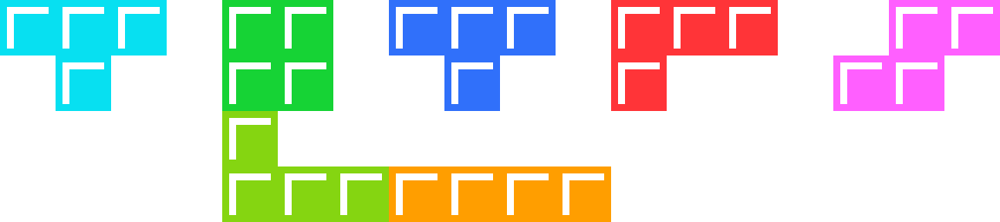
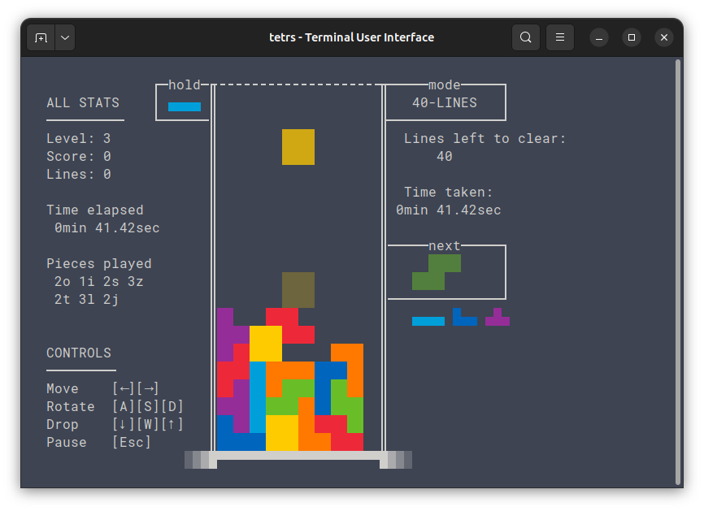
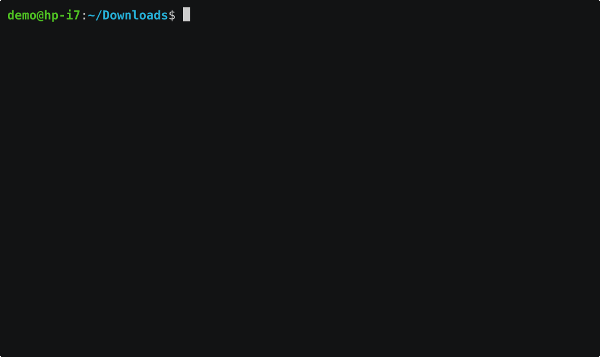
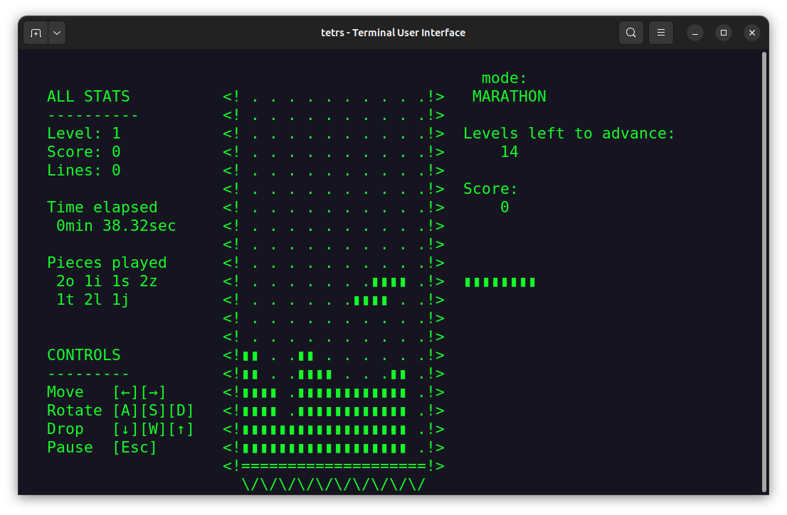
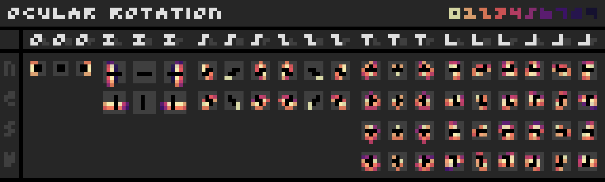
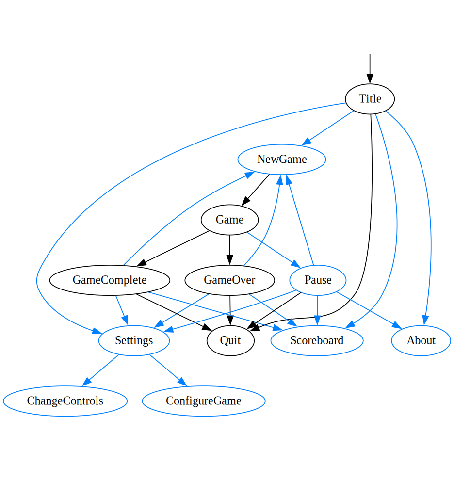

<div align="center"></div>


<div align="center" style="text-align: center; width: 100%">
<h1>Tetromino Game Engine + Terminal Application</h1>
</div>

This repo contains:
- `tetrs_engine`, a tetromino game backend – capable of handling modern 'stacker' mechanics;
- `tetrs_tui`, a basic cross-platform Terminal User Interface – providing a sufficiently polished, familiar game experience.

<!--
---

**(Author's Note : Due to irl circumstances I cannot continue development right now - issues may be worked on at a later time)**

---
-->


## How to run

1. [Download a release](https://github.com/Strophox/tetrs/releases) for your platform if available.
2. Open your favourite terminal and run the TUI app (i.e. `./tetrs_tui` or `tetrs_tui.exe`)

> Or compile it yourself:
> 1. Have [Rust](https://www.rust-lang.org/) (≥1.83.0) installed.
> 2. `git clone` / download this repository.
> 3. Navigate to `tetrs/` and `cargo run`.

> [!IMPORTANT]
> Use a terminal like [kitty](<https://sw.kovidgoyal.net/kitty/>) (or any terminal with [support for progressive keyboard enhancement](https://docs.rs/crossterm/latest/crossterm/event/struct.PushKeyboardEnhancementFlags.html)) for smoother gameplay experience.
> Also note that **otherwise DAS / ARR / Soft drop speed will be determined by keyboard / OS / terminal emulator settings** (and not by tetrs).
> 
> > <details>
> > 
> > <summary> Explanation. </summary>
> > 
> > Terminals usually only send "key pressed once" signals, and no "key was released now". This becomes a problem for mechanics such as "press left to move left repeatedly *until key is released again*".
> > To solve this, [Crossterm](https://docs.rs/crossterm/latest/crossterm/) tries to detect when a terminal is ['kitty-protocol'/'enhanced key events'](https://sw.kovidgoyal.net/kitty/keyboard-protocol/#progressive-enhancement)-compatible, which means the terminal has modern support for "key released" etc. signals. This is why special terminals like Kitty provide a smoother, more configurable tetrs experience.
> > 
> > </details>


## Tetrs TUI Gallery

**Classic game experience:**




**[Efficient](#performance-consideration) rendering in consoles, configurable controls, etc.:**


**Various tileset + coloring combinations possible:**

<details>

<summary>ASCII demo (GIF)</summary>



</details>


<details>

<summary>Electronika 60 demo (PNG)</summary>



*\*For display just like in the screenshot set your terminal text color to green and font to a Unicode-compatible one (e.g. `DejaVu Sans Mono` works)*

</details>


# Features of the Tetrs TUI


### Main Gameplay

<details>

<summary> List of basic gameplay aspects. </summary>

- Familiar tetromino stacker experience: Move, rotate, soft-drop, hard-drop and hold tetrominos and successfully clear horizontally completed rows.
- Tetrominos colored by type.
- Preview of upcoming tetromino(s).
- 'Ghost' tetromino (preview of where it will land).
- Animations for: Hard drop, line clear, tetromino locking on ground.
- Game stats: Current gravity level, lines cleared, points scored, time elapsed, pieces placed.
- etc.

For more technical gameplay discussion see [Features of the Tetrs Engine](#features-of-the-tetrs-engine).

</details>


### Gamemodes

<details>

<summary> List of gamemodes available through the TUI. </summary>

- Standard tetrs engine modes:
  - **40-Lines**: "How fast can you clear forty lines?"
  - **Marathon**: "Can you make it to level 15?"
  - **Time Trial**: "What highscore can you get in 3 minutes?"
  - **Master**: "Can you clear 30 levels at instant gravity?"
- Modes created using the engine's 'modding' system:
  - **Puzzle**: "Get perfect clears in all 24 puzzle levels." *Note:* This mode is intended to be played (and in fact demonstrates) the [Ocular Rotation System](#ocular-rotation-system).
  - **Cheese**: "Eat through lines like Swiss cheese."
  - **Combo**: "Get consecutive line clears."
  - **Descent (experimental)**: ???
- Custom mode: Customizable initial gravity, auto-increase gravity, game limit (Time, Score, Pieces, Lines, Gravity, or no limit).

</details>
  

### Settings

<details>

<summary> List of settings customizable in the TUI. </summary>

- **Graphics options**:
   - Glyphset: 'Unicode', 'ASCII', 'Electronika 60'
   - Coloring: 'Fullcolor' (RGB palette), 'Color 16' (compatibility with consoles), 'Monochrome'
   - FPS & show FPS counter toggle
   - Enable/disable effects
- **Adjustable keybinds**:
  - Slot system with three defaults: 'tetrs defaults', 'Vim', 'Guideline'.

  <details>
  
  <summary> Default tetrs controls. </summary>
  
  | Key | Action |
  | :-: | :- |
  | `←` | Move left |
  | `→` | Move right |
  | `A` | Rotate left (CCW) |
  | `D` | Rotate right (CW) |
  | `S` | Rotate around (180°) |
  | `↓` | Soft drop |
  | `↑` | Hard drop |
  | *(no def.)* | Sonic drop |
  
  Special controls:

  | Key | Action |
  | :-: | :- |
  | `Esc` | Pause game |
  | `Ctrl`+`D` | Forfeit game |
  | `Ctrl`+`C` | Abort program |
  | `Ctrl`+`S` | Store savepoint |
  | `Ctrl`+`E` | Store seed |
  | `Ctrl`+`B` | Store board |
  
  </details>
  
- **Configurable gameplay**:
  - Rotation systems: 'Ocular', 'Classic', 'Super'
  - Piece generation: 'Recency', 'Balance relative counts', 'Uniformly random', 'Bag'
  - Preview count: default=4, possible values: 0 – "how wide is your terminal"
  - Various timings: 'Delayed auto shift' (DAS), 'Auto repeat rate' (ARR), 'Soft drop factor' (SDF), 'Line clear delay', 'Appearance delay'
- **Keep Save File**: The TUI will not store any additional data by default where you run it. You can **explicitly toggle on save data** to have it remember things - at various granularities:
  - *OFF* - This will delete any existing save file upon program exit.
  - Remember *Settings* - This will only remember what you have stored in settings (including New Game settings).
  - Remember all the above *+ Scores* - This will additionally store a lightweight scoreboard with basic info.
  - Remember all the above *+ Game recordings* - This will additionally store the data needed to watch a game replay of past games.
    A game recording consists of the initial game state + list of (encoded) user button inputs during gameplay.

</details>


<details>

<summary> More info about TUI controls. </summary>

The controls of the TUI menus are mostly kept simple.

  | Keys | General meaning |
  | :-: | :- |
  | `↓`,`↑` or `j`,`k` | Navigate |
  | `←`,`→` or `h`,`l` | Change value |
  | `Enter` or `e` | Select |
  | `Esc` or `q` | Return back |
  | `Del` or `d` | Delete/reset |
  |  |  |
  | `Ctrl`,`Shift` | Accelerate timeline controls for "Load savepoint" |
  | `1`,`2`,`3`... | Quickselect gamemode in "New Game" menu |


</details>


### Scoreboard

<details>

<summary> List of settings customizable in the TUI. </summary>

There is currently a minimalistic singleplayer scoreboard implementation which displays past stats of all recorded games played, roughly sorted by score.

> Note: games with 0 cleared lines are auto-deleted on save

</details>


# Features of the Tetrs Engine

> For accurate and detailed information about the engine refer to documentation / the code itself.*

The point of the tetrs engine is that it is frontend-agnostic (the tui mostly serves as an elaborate proof-of-concept).
Very basic interaction with the engine is decoupled from actual user input or passing of time, the engine is merely a 'simulator' for the underlying tetromino game and keeps its own notion of a simulated timeline. Consider the following example:

```rust
// Starting a round of the game.
let game = tetrs_engine::Game::new(Gamemode::marathon());

// Application loop.
loop {
  // Updating the game with a new button state at a point in time.
  game.update(Some(new_button_state), update_time);
  // ...
  // Updating the game with *no* change in button state.
  game.update(None, update_time_2);

  // Read most recent game state:
  let GameState { board, .. } = game.state();
  // (Do rendering, etc...)
}
```
Notice that `game` does not advance its internal state until the caller of `game.update(...)` specifies the next `update_time`-point (which might or might not involve changes in user interaction).

> `tetrs_engine` can be used as a [dependency from git](https://doc.rust-lang.org/cargo/reference/specifying-dependencies.html#specifying-dependencies-from-git-repositories) by adding the following line to `Cargo.toml`:
> 
> ```toml
> [dependencies]
> tetrs_engine = { git = "https://github.com/Strophox/tetrs.git" }
> ```

<details>

<summary> Overview of tetrs engine internals </summary>

tetrs makes liberal use of Rust's type system to encode its many, but meaningful data structures.

The `Game` struct central to the entire engine, together with an `update` function, is defined as follows:
```rust
pub struct Game {
    config: GameConfig,
    mode: GameMode,
    state: GameState,
    rng: GameRng,
    seed: u64,
    modifiers: Vec<FnGameMod>,
}

impl Game {
  fn update(
      &mut self,
      mut new_button_state: Option<PressedButtons>,
      update_time: GameTime,
  ) -> Result<FeedbackMessages, UpdateGameError>
}
```
And everything else should follow from there.

Roughly:
- `GameConfig` holds game configuration which is almost 'cosmetic' - it can be changed while the game is running without big issues.
- `GameMode` holds certain rules concerning progression, such as difficulty increase and win/loss conditions.
- `GameState` holds internal game state.
- `GameRng` is the game-own PRNG.
- `seed: u64` is the starting seed.
- `Vec<FnGameMod>` are custom modifiers which are the current mechanism to 'mod' the engine/a game.

> For accurate and detailed information about the engine refer to documentation / the code itself.

</details>


# State of the Project

## Known Issues

- The README is too big. Well... rather the documentation of `tetrs_engine` is disproportionately too small.
- [bug] Buttons pressed in-game, held, and unpressed in the Pause menu do not register as unpressed in-game.


## Performance Considerations

> [!IMPORTANT]
> This part is fairly informal. Benchmarking is yet to be done.

We list considerations regarding perfomance of both the tetrs engine and TUI:
* Being written in Rust, there is already a certain assumption that overall program performance should suffice for modern use cases, especially/specifically given the small scope of the game.
* The underlying engine was developed with a mental model of: "make the underlying game logic work with the minimum X needed."
  * Certain frontend features, out of vast convenience, do demand 'unnecessary' additions, such as the `Feedback` mechanism to effectively render hard drop-, line clear- and piece locking effects.
  * Given a client of the tetrs engine, its 'modding' features may be (ab)used to arbitrarily degrade performance.
* The TUI frontend seems to generally have been bottlenecked by I/O operations.
  * The current implementation therefore employs a 'cached renderer' which computes the diff between two frames to be rendered and only redraws characters in the terminal which change.


## Future Work

- `TODO`s serve as important markers for issues/features that should be dealt with 'ASAP' or at least before releases.
- Long-term `FIXME`s in the code base.
- General improvements to the tetrs engine:
  - Better API documentation (`cargo doc --open`).
  - Better implementation/code comments.
  - Refactor of complicated systems (e.g. locking).
  - *(In an ideal world.)* Certainty of panic-freedom of `Game::update` (without use of mods).
- Better code comments for TUI in case it ever does get improved / refactored.
- Possibly remove `#[allow(…)]`, `#[allow(rustfmt::…)]`, , `#[allow(clippy::…)]`.
- List of `tetrs_engine` features?...
  - Small but attractive details of the `tetrs_engine` are not properly explained, e.g., an available *initial rotation system* which allows a piece to spawn already rotated if a rotation button was being held.


## Contribution Guidelines

Issues especially are welcome if you encounter any problems! Both in the engine and the TUI

Note that the TUI itself was (in principle) started as 'proof-of-concept'.
It expanded in scope but unfortunately the code is not in an easy-to-modify state, especially to new contributors.


## Provenance

100% human-grown spaghetti code


## License

The code in this repository is licensed under MIT, see `LICENSE`.


# Project Highlights

I wanted to get things right, in a way that felt right to me even if I knew all of the game's context/history.

A [2009 Tetris Guideline](https://tetris.wiki/Tetris_Guideline) served as basic inspiration but wasn't very enlightening on many mechanics.
The bulk of information came from amateur online research into as many of the game's details 'vanilla' mechanics as possible. (Thank you, [Tetris Wiki](https://tetris.wiki/) and [HardDrop](https://harddrop.com/wiki)!) 
I also got some help from people;
I'd like to thank in particular:
- **GrBtAce**, **KonSola5** and **bennxt** for helping me with my questions early in development :-)
- **Dunspixel** for the O-spin inspiration
- **madkiwi** for advice regarding 4wide 6res layouts

The following sections detail various aspects I found to be the most interesting to tackle while working on this projec!


## Tetromino Generation

[The random generation of Tetrominos](https://simon.lc/the-history-of-tetris-randomizers) is interesting (and a beginner-friendly place to re-invent the wheel).

The canonical way to generate a random sequence of tetrominos is to do so *uniformly at random*.
This makes for a playable game, although there are several 'issues'.
- One could get the same piece many times in a row.
- One could *not* get a given piece, for quite a while. (This is an issue even for better-balanced randomizers, where players may feel like they're surviving a 'drought' for a certain piece.)

In modern games, the *bag* randomizer is ubiquitous;
This system takes all 7 pieces once (the 'bag'), then hands those out in random order, rinse and repeat.
- Even in the worst case it is guaranteed that an `I` piece will come after 12 pieces. With this system one can relatively easily keep track of where one 'bag' starts and ends.
- Subjectively and arguably, this system over-determines the pieces a player will receive in their game: They will always receive the exact same number of each tetromino variant.

An alternative that seems to work well is a *recency-based* randomizer;
Remember the last time each tetromino type was generated as a number - when choosing the next piece randomly, do so weighted by this number to increase the likelihood of choosing one that was long ago.
- This preserves "possibly complete randomness" in the sense that *any* piece may be generated at any time - it's just much less likely.
- This system is strongly biased to mitigate droughts and same pieces in sequence without setting a fixed number of each tetromino type to be generated.


## Ocular Rotation System

> "[tetris has a great rotation system and is not flawed at all](https://www.youtube.com/watch?v=_qaEknA81Iw)"

— *said no one ever, after seeing the Super Rotation System, not even [the creator of Tetris himself](https://youtu.be/6YhkkyXydNI?si=jbVwfNtfl5yFh9Gk&t=674).*

Despite its notorious quirks, the official and standardize *Super Rotation System* somehow [gets its job done](https://www.youtube.com/watch?v=dgt1kWq2_7c).
The responsibility it bears is immensive given the size of the franchise and variety of players.

But quirks it *does* have, so many that I did think a remake was overdue.


<details>

<summary> Creating a Rotation System. </summary>

My personal gripes with SRS are:

- The system is not symmetric.
  - Symmetric pieces can look exactly the same in invisibly different rotation states, [but have different behaviour](https://blog.battlefy.com/how-accidental-complexity-harms-the-tetris-community-93311461b2af).
  - For symmetrical pieces, rotation is different depending on whether it's right or left (even though it should be symmetric too).
- It aims to be an [advanced system](https://harddrop.com/wiki/SRS) demonstrated by aspects like different rotation points for different purposes. Yet it in fact re-uses the exact same kicks for 5 out of the 7 pieces, even though those arguably should have completely different symmetries.
- <sup>(Not a hot take, but some rotations are just *weird* to have been chosen over other possibilities.)</sup>
- Unintuitive piece elevators.

General criteria for a good rotation system (that I can think of) would be:

1. Rotation must behave visually **symmetrically**:
    - Equal-looking rotation states must behave the same;
    - And mirroring the board/pieces mirrors the rotation behavior perfectly.
2. The kicks should be **intuitive**:
    - The way pieces rotate should look 'feasible' to any given person (e.g., the new position should not be completely disjoint from previously.)
3. Rotation should be **fun**! :D
    - Ideally, rotations should 'feel good' to the player.

An attempt to achieve these goals was the *Ocular Rotation System*.
It was primarily created by *looking* at a given piece + orientation, and drawing the 'best' position(s) for it to land in after a rotation.

I present to you, a heatmap overview of the Ocular Rotation System:


**How to read it**:
Such a heatmap is created by considering each combination of (piece, orientation, rotate left or right).
By overlapping all the _new_ possible positions for a piece after rotation, one gets a compact visualization of where the piece will most likely land, going from brightest color (yellow, first attempt to position the piece) to darkest (purple, last attempt to position the piece):

Here is a comparison with the Super Rotation System's heatmap:


With the SRS heatmap one starts to spot some rotational symmetries (i.e., you can always rotate *back-and-forth between two positions*).
This is arguably overshadowed by all the asymmetrical kicks, and very lenient vertical (downwards and upwards) kicks which contribute to an unintuitiveness to SRS' kicks.

</details>

I'm happy with how this new rotation system turned out.
It mostly follows the mantra "if the rotation looks like it could *visually* reasonably work, it should" (+ some added kicks for flexibility and fun).
Hence its name, *Ocular* rotation system.

> [!TIP]
> Play **Puzzle Mode** with its 24 stages to test the custom [Ocular Rotation System](#ocular-rotation-system).

<details>

<summary> Ocular Rotation System - Detailed Comments </summary>

The general rationale behind most kicks is, "these first kicks feel most natural, any additional kicks after that serve flexibility, cool tricks and skill ceiling". But additional heuristics can be stated:
- A general trend of its kicks is to *disallow needless upwarping* of the piece. This means we first prefer rotations into a position *further down* before trying further up (and completely foregoing nonsensical upward kicks in the first place).
- New positions must look 'visually close' to the original position. There are no completely disjoint rotation states, i.e., the old and new position always overlap in at least one tile. This heuristic also influenced the **L**/**J** rotations, where it instead inpires the incorporation of all possible rotations where two tiles of the state overlap with the old state.
- The **I**, **S** and **Z** pieces are more rotationally symmetric than **T**, **L** and **J**, because from a given state they yield the same shape whether rotated left or right.
  However, they do not have a natural 'center' in a way that would allow them to be rotated symmetrically in the grid, *specifically:* we are forced to choose their new position to be more left or right, arbitrarily. We use this to our advantage and allow the player to have direct control over this using either of the two rotation directions. This arguably aids both directional intuition as well as finesse skill ceiling. It should not hurt rotational intuition ("piece stays in place if rotated 360°") as a player in principle should never need to rotate such symmetrical pieces (especially mid-air) more than once anyway.


*\*Notation*: `nTlr 0-3` describes kick positions `0` to `3` when rotating a `n`orth-facing `T`-piece to the `l`eft _or_ `r`ight.



- **O**-piece.
  - As the most symmetrical piece, having no kicks would be most natural, but also make it the only piece where rotation is 'useless'. Adding limited kicks however already turns out to be very useful to the player:
    - `nOl 0`: Simple sideways O-'roll', providing a second way to move O.
    - `nOl 1`: Allows for O-spins.
    - `nOl 2`: Also allows for O-spins and - more likely - 'rolling' the O out of a shallow well, possibly useful under high gravity.
    - `nOl 3`: While invisible on the chart, this technically allows the O to *always* successfully change its orientation upon rotation.
- **I**-piece.
  - As the longest piece, it has the most kicks to accommodate its visual range. What's special is that in its horizontal position it may rotate left or right into *any* reachable space around itself.
    - `nIl 0-7`: Rotating in it from a horizontal to a vertical position will very strongly prefer placing it in the desired direction of rotation first.
    - `nIl 8-9`: Fallback rotation states.
    - `eIl 5-6`: Allows tucking the I down flat.
    - Non-existent higher-positioned `eIl`: Intentionally left away to prevent upwarping.
- **S**/**Z**-piece.
  - The rotations for these pieces also allow for directional finesse.
    - `nSZlr`: Kept simple and symmetrical.
    - `eSr 2`|`eZl 2`: Useful and commonly applicable S/Z spin.
    - `eSl 2`|`eZr 2`: Tucking in an S/Z in this position might be handy.
- **T**-piece.
  - This piece has a relatively natural center of rotation, making for a good first rotation reposition.
    - `neswTlr 0`: 'Center' rotation.
    - `nTlr 4`: A T-'turn'.
    - `eTl 4`|`wTr 4`: A T-'insert', allowing it to warp down.
    - `sTlr 4`: A T-'turn'.
    - `sTlr 5`: This kick enables T-spin triples.
    - `wTl 3-4`|`eTr 3-4`: Two T-'turns'.
- **L**/**J**-piece.
  - Surprisingly, the most common center of rotation for L/J does not lead to a first rotation reposition where an overlap of two tiles with the original position is observed.
    - `neswLJlr 0`: 'Center' rotation.
    - `nLl 4`|`nJr 4`, `eLl 5`|`wJr 5`, `sLl 2`|`sJr 2`, `wLl 1`|`wJr 1`: Additional 'wall'-kicks that come after trying the 'center' rotation.
    - `nLr 4`|`nJl 4`, `eLr 5`|`wJl 5`, `sLr 4`|`sJl 4`, `wLr 2`|`eJl 2`: Somewhat weird kicks that are mostly included due to context and symmetry in rotation.
    - `wLl 6-7`|`eJr 6-7`: Two ways to specially tuck an L/J down.
    - `sLr 6`|`sJl 6`: Allows rotation into upright state even when resting on other blocks in a well.

</details>

## Piece Locking

The mechanics of locking down a piece on the grid can be more complicated than it might sound at first glance.

Good criteria for a locking system I can think of would be:

1. Keep players from stalling / force players to make a choice eventually.
2. Give players enough flexibility to manipulate the piece even if it's on the ground.
3. Force players to *react/input faster* on faster levels, as speed is supposed to increase.
4. Implement all these limitations as naturally/simply as possible.

So I started looking and deciding which locking system to implement;

<details>

<summary> Creating a Locking System. </summary>

*Classic lock down* is simple, but if one decreases the lock timer on faster levels (3.) then it might become exceedingly difficult for players to actually have enough time to do adjustments (2.).

<details>

<summary> Classic Lock Down </summary>

> - If the piece touches a surface
>   - start a lock timer of 500ms (\**var with lvl*).
>   - record the lowest y coordinate the piece has reached.
> - If the lock timer runs out, lock the piece immediately as soon as it touches the next surface.
> - If the piece falls below the previously lowest recorded y coordinate, reset lock timer.

</details>

*Infinite lock down* essentially mitigates the flexibility issue by saying, *"if the player manipulated his piece, give him some more time"*. 
It's very simple, but the fact that it lets players stall forever (1.) is less nice.

<details>

<summary> Infinite Lock Down </summary>

> - If the piece touches a surface
>   - start a lock timer of 500ms (\**var with lvl*).
> - If the lock timer runs out, lock the piece immediately as soon as it touches the next surface.
> - If the piece moves/rotates (change in position), reset lock timer ('move reset').

</details>

The standard recommended by the guideline is therefore *extended placement lock down*.

<details>

<summary> Extended Placement Lock Down </summary>

> - If the piece touches a surface
>   - start a lock timer of 500ms (\**var with lvl*).
>   - start counting the number of moves/rotates the player makes.
>   - record the lowest y coordinate the piece has reached.
> - If the piece moves/rotates (change in position), reset lock timer ('move reset').
> - If the number of moves reaches 15, do not reset the lock timer anymore.
> - If the lock timer runs out, lock the piece immediately as soon as it touches the next surface.
> - If the piece falls below the previously lowest recorded y coordinate, reset counted number of moves.

*(\*This probably misses a few edge cases, but you get the gist.)*

</details>

Yeah.

It's pretty flexible (2.) yet forces a decision (1.), but the 'count to 15 moves' part of this lock down seems somewhat arbitrary (4.)
<sup>*(\*Also note that after the 15 moves run out one can still manipulate the piece till lock down.)*</sup>

> **Idea.**
> 
> What if we limit the *total amount of time a piece may touch a surface* (1.) instead of number of moves/rotates (4.), but on faster levels the piece *attempts* to lock down faster (3.), re-attempting later upon move/rotate;
> This still allows for plenty <sup>*\*technically arbitrarily many*</sup> piece manipulations (2.) while still fulfilling the other points :D

<details>

<summary> 'Timer' Placement Lock Down </summary>

*Let 'ground time' denote the amount of time a piece touches a surface*

> - If the piece touches a surface
>   - start a lock timer of 500ms (\**var with lvl*).
>   - start measuring the ground time.
>   - record the lowest y coordinate the piece has reached.
> - If the piece moves/rotates (change in position), reset lock timer ('move reset').
> - If the lock timer runs out *or* the ground time reaches 2.25s, lock the piece immediately as soon as it touches the next surface.
> - If the piece falls below the previously lowest recorded y coordinate, reset the ground time.

Nice.

</details>

Although now it *may potentially* be abused by players which keep pieces in the air, only to occasionally touch down and reset the lock timer while hardly adding any ground time (note that this problem vanishes at 20G).

A small patch for this is to check the last time the piece touched the ground, and if that was, say, less than 2×(drop delay) ago, then act as if the piece had been touching ground all along. This way the piece is guaranteed to be counted as "continuously on ground" even with fast upward kicks of height ≤ 2.

</details>

In the end, a timer-based extended placement lockdown (+ ground continuity fix) is what I used.
Although there might be a nicer system somehow..


## Scoring

I suspect coming up with a *decent* [scoring system](https://tetris.wiki/Scoring#Recent_guideline_compatible_games) is easier with the help of playtesters or at least practical game experience.

I did try to come up with a new, simple, good formula, but it's tough to judge how much to reward the player for any given action (How many points should a 'perfect clear' receive, given that I can't remember to have gotten one more than once?).

The one I came up with, *'probably sucks'* in some way, but I allowed myself to experiment, because I really wanted to reward [all types of 'spins' equally](https://harddrop.com/wiki/List_of_twists) (explicitly: I didn't understand modern Tetris' obsession with T-spins, when S-, Z-, L- and J-spins are also - if not more - satisfying).

The current scoring formula is given as follows:

```python
def score_bonus(
    lines, # Number of lines cleared simultaneously.
    combo, # Number of consecutively played pieces causing lineclear. Is always ≥1 if lines ≥ 1.
    is_spin, # Was piece unable to budge when it locked down?
    is_perfect, # Was board empty after lineclear?
  ): return (
    lines * (2 if is_spin else 1) * (4 if is_perfect else 1) * 2 - 1 + (combo - 1)
  )
```

<details>

<summary>Reasoning</summary>

**Reasoning - motivation:**
If we remove any artificial goals or limits, this game allows play forever.
But it is the ways of playing that can differ:
- A player may always survive by clearing single lines as soon as possible to keep their stack low.
- A player may always leave a 'well' in their stack and clear four lines at once. This appears 'cooler'/'more elegant'/'more skillful' etc.
Therefore, besides survival, we may try to reward 'especially skillful play' through a scoring method.
This is quite subjective, but we can try anyway.

Note that, for simplicity, currently a bonus to the score is triggered when a lineclear occurs - although it would also be feasible to reward, e.g. spins which do not clear a line but still 'look' satisfying or display skill!

**Reasoning - scoring formula:**
As a general rule, higher score should correlate with 'how impressive' style of play is.
But the weighing of various maneuvers in relation to each other is difficult to judge.

For singles, easy rules can be set:
1. Let's assign a unit point to the fundamental single lineclear: `I -> +1`.
2. A double lineclear should give more than a combination of other basic clears: `II -> +3` (> `I I -> 2`).
3. A triple lineclear should give more than a combination of other basic clears: `III -> +5` (`III III -> 10` > `II II II -> 9`).
4. A quadruple lineclear should give more than a combination of other basic clears: `IV -> +7` (`IV IV IV -> 21` > `III III III III -> 20`).

Furthermore, bonuses from 'streak'-like maneuvers:

5. Combos ('clears by consecutive tetrominos'): They can be generated en masse with certain strategies (though the longest achievable combo is bounded). This leads us to believe they should not yield exceedingly large score bonuses. The most basic way is to still reward higher combo is to just add the length of the combo to the score: `Combo n -> +n`
6. Back-to-Backs ('consecutive clears by Quadruple/Spin/Combo'): This form of score bonus is common to other tetromino stackers and can be kept up potentially ad infinitum. It additonally rewards the best maneuvers. With the current scoring method, which does this anyay, we are led to believe that B2B is not needed as incentive.

Special maneuver bonus conditions:

7. Spins ('pieces locked by rotation'): In common tetromino stackers, T-spins are already rewarded massively (and in specific ways for various subtypes, but not other tetromino types). What matters is that any spin requires 'knowledge' on how to use the rotation system to fill unlikely gaps on the board. A spin generally enhances the impressiveness of a lineclear. We decide to make it a multiplier to the number of lineclears registered: `Spin -> #I *= 2`.
8. Perfect Clears ('board blank after lineclear'): With certain piece generators, strategies can be used to greatly increase the generation of perfect clears, therefore should not yield an _exceedingly_ large score bonus. But they are still fundamentally satisfying to look at. We decide to set: `Perfect Clear -> #I *= 4`.

</details>


<details>

<summary>Table of Example Bonuses</summary>

*A table of some example bonuses:*
| Score bonus | Action |
| -: | :- |
| +  1 | Single |
| +  3 | Double |
| +  5 | Triple |
| +  7 | Quadle |
| +  3 | ?-Spin Single |
| +  7 | ?-Spin Double |
| + 11 | ?-Spin Triple |
| +  2 | Single #2. |
| +  4 | Double #2. |
| +  6 | Triple #2. |
| +  8 | Quadle #2. |
| +  4 | ?-Spin Single #2. |
| +  8 | ?-Spin Double #2. |
| + 12 | ?-Spin Triple #2. |
| +  3 | Single #3. |
| +  5 | Double #3. |
| +  7 | Triple #3. |
| +  9 | Quadle #3. |
| +  5 | ?-Spin Single #3. |
| +  9 | ?-Spin Double #3. |
| + 13 | ?-Spin Triple #3. |
| +  4 | Single #4. |
| +  6 | Double #4. |
| +  8 | Triple #4. |
| + 10 | Quadle #4. |
| +  6 | ?-Spin Single #4. |
| + 10 | ?-Spin Double #4. |
| + 14 | ?-Spin Triple #4. |
| +  7 | Perfect Single |
| + 15 | Perfect Double |
| + 23 | Perfect Triple |
| + 31 | Perfect Quadle |
| + 31 | Perfect ?-Spin Double |

<details>

<summary>(Above table was generated with Python:</summary>

```python
# NOTE: Use above `def score_bonus(lines,combo,is_spin,is_perfect)` before calling the following code!
def table():
  names = ['Single','Double','Triple','Quadle']
  row = lambda l,c,s,p: print(f"| +{score_bonus(l,c,s,p): >3} | {'Perfect ' if p else ''}{'?-Spin ' if s else ''}{names[l-1]}{f' #{c}.' if c > 1 else ''} |")
  print("| Score bonus | Action |")
  print("| -: | :- |")
  for combo in [1,2,3,4]: # Or up until 20 etc.
    for is_spin in [0,1]:
      for lines in range(1, 4+1-is_spin): # Spins impossible for lines >= 4.
        row(lines,combo,is_spin,0)
  for lines in [1,2,3,4]:
    row(lines,1,0,1) # Perfect clears with out spins or combos.
  row(2,1,1,1) # Perfect clear with spin without combo (only possible for 2 lines.)
```

</details>

</details>


## Keybinds

A search for the 'best' / 'most ergonomic' game keybinds was [inconclusive](https://youtube.com/watch?v=6YhkkyXydNI&t=809).
In a sample of a few dozen opinions from reddit posts there was about a 50/50 split on

| move | rotate |
| - | - |
| `a` `d` | `←` `→` |
| `←` `→` | `z` `x` |

Frequent advice seen was: "Choose what feels best for you.\*"
*(\*There were explicit mentions that 'hard drop' being bound to `spacebar` is suboptimal for fast play.)*

The current tetrs default keybinds were kept straightforward:
- "~~`W`,~~`A`,`S`,`D`" - rotating
- "`←`,`→`" - moving
- "`↑`,`↓`" - dropping
- "`Space`" - holding


## Menu Navigation

Modeling how a TUI should handle menus and move between them is not straightforward for more complex systems.

I looked at how [Noita](https://noitagame.com/)'s menus are connected and saw that it seemed structured in a way that I could imitate:
The menus form a graph (with menus as nodes and valid transitions as directed edges).
Most menus can be backtracked (i.e. pushing and popping a stack), though some menus do not allow backtracking to previous menus (e.g. Game Over) (alternatively, they clear the stack).

<details>

<summary>Tetrs TUI menu graph</summary>



</details>


## Combo Bot

[Screencast from 2024-09-08 22-21-45 combot-demo.webm](https://github.com/user-attachments/assets/a3d96655-7d96-4f87-80ff-b1c86840ced3)


### Background

<details>

<summary>Background info</summary>

The goal of 'Combo Mode' is to keep a combo going for as many pieces/lines as possible, where combo is maintained by clearing lines with consecutive pieces.

The fact that this is playable as its own gamemode is due to a special strategy known as the *4 wide (3 residual) combo setup*.
Here the board is completely filled except for a dedicated 4-wide vertical tunnel, at the bottom of which there are always 'residual' cells that help in clearing a line with the upcoming piece.

It turns out there are only a finite number of these configurations inside a 4-wide well are useful to keep a combo:

**Image of 4-wide 3-residual combo setup configurations:**


*Notice how due to the fact that a tetromino consists of 4 cells, clearing a line like this will always leave another 3 cells in the otherwise perfectly vertical 4-wide tunnel.*

Graphic with modifications courtesy of [harddrop](https://harddrop.com/wiki/Combo_Setups#4-Wide_with_3_Residuals).

</details>


### Problem Approach

<details>

<summary>Problem approach</summary>

Given finite piece preview and armed with the knowledge of how these combo states transition into each other, how do we find the best way to continue a combo?

It turns out we can model this as a [graph](https://en.wikipedia.org/wiki/Graph_(abstract_data_type)) where we can see what paths we can take from our current state:


**Graph of all states reachable with 4 preview pieces + hold:**


Different decisions can be made depending on whether we hold the current piece and use a different one, which can radically change the outcome.

What the bot does with this is to look at the farthest states it finds, and chooses the branch that maximizes depth and possibilities to make different decisions later on (states with many continuations).

While humans can vaguely do this for certain previews and also get a feeling for it, one can program a computer to do this automatically even for larger preview sizes (see a [12-lookahead state graph here](/Gallery/combo/combo_12-lookahead-graph.svg)).

The bot currently only supports lookahead up to 42 (number of bit triplets that fit into `u128`), although it already tends to get quite slow for values half of that.
As we'll see, it still does pretty okay for reasonable preview sizes.

</details>


### Results and Evaluation

<details>

<summary>Results and evaluation</summary>

<details>

<summary>
Sidenote: <i>weeeeeee</i>
</summary>

[Screencast from 2024-09-08 22-52-51 combot-weee.webm](https://github.com/user-attachments/assets/8506a73c-446b-431a-ad78-ce0617023a0a)

</details>

The bot does pretty well and gets seemingly exponentially longer combos with larger preview window, as can also be seen from the following chart.

| Samples | Randomizer | Lookahead | Median combo | Average combo | Maximum combo |
|-|-|-|-|-|-|
| 10000 | 'bag' | 0 |    8 |   11 |   114 |
| 10000 | 'bag' | 1 |   17 |   22 |   232 |
| 10000 | 'bag' | 2 |   29 |   40 |   426 |
| 10000 | 'bag' | 3 |   50 |   76 |   695 |
| 10000 | 'bag' | 4 |   82 |  129 |  1434 |
| 10000 | 'bag' | 5 |  150 |  244 |  2435 |
| 10000 | 'bag' | 6 |  300 |  502 |  5028 |
| 10000 | 'bag' | 7 |  540 |  985 | 10663 |
| 10000 | 'bag' | 8 | 1123 | 2126 | 24040 |
| 10000 | 'bag' | 9 | 2255 | 4199 | 54664 |

It is also interesting to note the differences depending on the [randomizer used to generate the next pieces](#tetromino-generation).

<details>

<summary>
Another table.
</summary>

| Samples | Randomizer | Lookahead | Median combo | Average combo | Maximum combo |
|-|-|-|-|-|-|
| 100000 | 'uniform'            | 3 |   15 |   23 |   287 |
| 100000 | 'balance-relative'   | 3 |   23 |   33 |   470 |
| 100000 | 'bag'                | 3 |   50 |   74 |   988 |
| 100000 | 'bag-2'              | 3 |   25 |   37 |   555 |
| 100000 | 'bag-3'              | 3 |   20 |   29 |   363 |
| 100000 | 'bag-2_restock-on-7' | 3 |   21 |   28 |   328 |
| 100000 | 'bag-3_restock-on-7' | 3 |   21 |   28 |   328 |
| 100000 | 'recency-0.0'        | 3 |   15 |   23 |   303 |
| 100000 | 'recency-0.5'        | 3 |   34 |   55 |   734 |
| 100000 | 'recency-1.0'        | 3 |   46 |   73 |   918 |
| 100000 | 'recency-1.5'        | 3 |   58 |   92 |  1238 |
| 100000 | 'recency-2.0'        | 3 |   68 |  107 |  1477 |
| 100000 | 'recency'            | 3 |   76 |  120 |  1592 |
| 100000 | 'recency-3.0'        | 3 |   83 |  129 |  1837 |
| 100000 | 'recency-7.0'        | 3 |  118 |  184 |  2715 |
| 100000 | 'recency-16.0'       | 3 |  223 |  374 |  4961 |
| 100000 | 'recency-32.0'       | 3 | 2583 | 4798 | 70998 |

</details>

Additionally, these benchmarks also produce visualization of the actual distribution of combos:


<details>

<summary>
It is interesting to note how these distributions can spread out quickly for higher lookaheads.
</summary>


</details>

<details>

<summary>
Running the bot on a uniform randomizer for 1'000'000 samples yields a much nicer, smooth curve.
</summary>


</details>

Basically all common randomizers I implemented will have a exponential-decay-looking curves smoothing out for many samples like this.

According to some [programming Okey\_Dokey did on 4wide combos](https://harddrop.com/forums/index.php?topic=7955), there are deadly sequences of 'bags' that will kill the combo (and needless to say, randomizers which allow truer forms of randomness can kill even more easily).
This somewhat explains that the curves are at least somewhat of exponential (decay) nature, as it gets more likely over time that the bot slips up and a random sequence appears that kills the combo.

<details>

<summary>
One more thing - I lied about all distributions looking the same.
</summary>

Look at this curious chart for the bag randomizer, which despite a million samples *does not* seem to smooth out:


What's happening with these obvious valleys and peaks?
Upon further inspection, the peaks are at: 6, 13, 20, 27, 34, 41, ... can you spot the pattern?

The answer is that the most of the runs die toward the end of a (7-piece) bag, because the bot optimizes paths expecting arbitrary pieces, but due to how this randomizer works every 7th piece is in fact *never* random, while every 7th+1 piece is *completely* random. That's why the bot is tripping over hurdles at those points, and shows that it is not actually making use of all the information that would be available to make the best decisions.

</details>

Overall this is an interesting topic in the overlap of tetromino randomizers, graph theory and a bit of statistics.
There's a larger space to be explored here - 4wide 3res is not the only combo setup (and this bot is pretty hardcoded in that respect). An interesting project would be to do something with 4wide 6res, which I heard is more resilient to combo killers, but that might have to wait for some other time :-)

> [!NOTE]
> The bot can be enabled to run in Combo Mode with a cmdline flag (`./tetrs_tui -e`).
> 
> To make it output the lookahead graphs, a feature is needed at compile time: `cargo run --release --features graphviz`.
> 
> To produce statistics, `cargo test <"simple"|"lookaheads"|"randomizers">` was used.

</details>


## Miscellaneous Author Notes

In the two very intense weeks of developing a majority of this project I had my first proper learning experience with building: a larger Rust project, an interactive game (in the console no less), and the intricacies of modern tetrs mechanics, all at the same time.

Gamedev-wise I can mention the [modern](https://gafferongames.com/post/fix_your_timestep/) [game](http://gameprogrammingpatterns.com/game-loop.html) [loop](https://dewitters.com/dewitters-gameloop/);
Finding a proper abstraction for `Game::update` (allowing arbitrary-time user input, making updates decoupled from framerate) wasn't so obvious at the beginning.

Frontend-wise I may as well have used [Ratatui](https://crates.io/crates/ratatui/), but decided to just do some basic menus using trusty [Crossterm](https://crates.io/crates/crossterm) for cross-platform terminal manipulation.
However, next time I should use a TUI crate so as to sleep more peacefully at night not having to take responsibility for the ~horrible ad-hoc code I wrote for the interface aaaAAAA .~

On the Rust side of things I read / learned about:
- some primers on [coding](https://docs.kernel.org/rust/coding-guidelines.html) [style](https://doc.rust-lang.org/nightly/style-guide/) [guidelines](https://github.com/rust-lang/rust-analyzer/blob/master/docs/dev/style.md#getters--setters) & `cargo fmt` (~`#[rustfmt::skip]`~),
- "[How to order Rust code](https://deterministic.space/how-to-order-rust-code.html)",
- an introduction to [writing](https://doc.rust-lang.org/book/ch14-02-publishing-to-crates-io.html) [documentation](https://rust-lang.github.io/api-guidelines/documentation.html) (like the fact they can even contain [tested examples](https://blog.guillaume-gomez.fr/articles/2020-03-12+Guide+on+how+to+write+documentation+for+a+Rust+crate#Hiding-lines)) & `cargo doc`,
- [`std` traits](https://rust-lang.github.io/api-guidelines/interoperability.html),
- using [serde](https://serde.rs/derive.html) (to [save some structured data locally](https://stackoverflow.com/questions/62771576/how-do-i-save-structured-data-to-file)),
- [conditional derives based on feature flags](https://stackoverflow.com/questions/42046327/conditionally-derive-based-on-feature-flag) & `cargo check --features serde`,
- [conditional compilation](https://doc.rust-lang.org/reference/conditional-compilation.html),
- basic [file system](https://doc.rust-lang.org/std/fs/index.html) shenanigans,
- [clap](https://docs.rs/clap/latest/clap/) to parse simple command line arguments (& passing them with `cargo run -- --descent-mode`),
- [formatting the time](https://docs.rs/chrono/latest/chrono/struct.DateTime.html#method.format) with [chrono](https://rust-lang-nursery.github.io/rust-cookbook/datetime/parse.html#display-formatted-date-and-time),
- [the `format!` macro](https://doc.rust-lang.org/std/fmt/#fillalignment) (the analogue to Python's f-strings! my beloved),
- [`debug_struct`](https://doc.rust-lang.org/std/fmt/struct.Formatter.html#method.debug_struct) (helpful to `impl Debug` for structs with weird fields),
- [the annoyances with terminal emulators](https://sw.kovidgoyal.net/kitty/keyboard-protocol/#progressive-enhancement) ~including how slow they can be~,
- [`BufWriter`](https://doc.rust-lang.org/std/io/struct.BufWriter.html) as an easy wrapper (diminished flickering!),
- [setting a custom panic hook](https://doc.rust-lang.org/std/panic/fn.set_hook.html) (TUI stuff tends to mess with console state upon crash),
- more practice with [Rust's module system](https://doc.rust-lang.org/book/ch07-00-managing-growing-projects-with-packages-crates-and-modules.html),
- super handy multithreading with [`std::sync::mpsc`](https://doc.rust-lang.org/std/sync/mpsc/)
- [cargo workspaces](https://doc.rust-lang.org/book/ch14-03-cargo-workspaces.html) (to fully separate frontend and backend),
- how [cargo git dependencies](https://doc.rust-lang.org/cargo/reference/specifying-dependencies.html#specifying-dependencies-from-git-repositories) work (so one could reuse the backend from this repository),
- and [cross](https://blog.logrocket.com/guide-cross-compilation-rust/#how-rust-represents-platforms)-[compilation](https://github.com/cross-rs/cross) (for releases).

All in all, Rust (known for its safety and performance while still providing ADTs) - proved to be an excellent choice for this project!

Also, can we appreciate how nice the name *tetrs* fits for a Rust game that does not infringe on TTC's copyright? <sup>~~though there were like a million other [`tetrs`](https://github.com/search?q=%22tetrs%22&type=repositories)'s on GitHub before me oof~~</sup>.

Other stuff:
- For the menu navigation graph I learned DOT (and used [graphviz](http://magjac.com/graphviz-visual-editor/)).
- For the combo bot graph I learned and generated simple [SVG](https://developer.mozilla.org/en-US/docs/Web/SVG/Tutorial) myself.
- For the terminal GIF recordings I used [asciinema](https://asciinema.org/) + [agg](https://github.com/asciinema/agg):
  ```bash
  agg --font-family="DejaVu Sans Mono" --line-height=1.17 --renderer=resvg --font-size=20, --fps-cap=30 --last-frame-duration=0  my_rec.cast my_rec.gif
  ```


*„Piecement Places!“* - [CTWC 2016](https://www.youtube.com/watch?v=RlnlDKznIaw&t=121).


<div  align="center">
  
`██ ▄▄▄▄ ▄█▀ ▀█▄ ▄█▄ ▄▄█ █▄▄`

</div>
